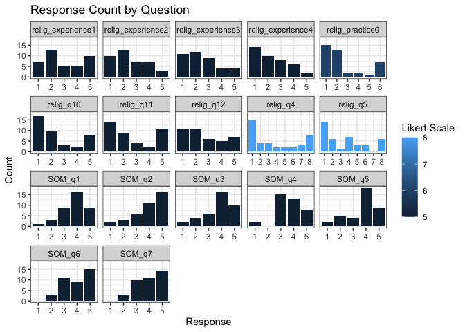

<!-- README.md is generated from README.Rmd. Please edit that file -->

# psych.data.cleanup

<!-- badges: start -->

<!-- badges: end -->

The `psych.data.cleanup` package provides an R interface to retrieve
data from surveys containing likert scale questionnaires. It converts
all invalid values to identical format, generates a nested object list
of descriptive statistics, and print it out to the user. You can
visualize the results in the RStudio plot window.

## Installation

You can install the development version of psych.data.cleanup from
[GitHub](https://github.com/) with:

``` r
# install.packages("pak")
pak::pak("XXinZ28/psych.data.cleanup")
```

## Usage

Given a religious optimism survey data, the `likert_scale_analyzer`
function returns a nested list object containing elements that
summarizes response counts for each question.

``` r
library(psych.data.cleanup)

likert_results <- likert_scale_analyzer(
  data = religious_som,
  likert_cols = c("relig_practice0", "relig_q4","relig_q5","relig_q10","relig_q11","relig_q12","relig_experience1","relig_experience2","relig_experience3","relig_experience4","SOM_q1","SOM_q2","SOM_q3","SOM_q4","SOM_q5","SOM_q6","SOM_q7"),
  invalid_values = c(" ", "NA")
) 
#> Warning in likert_scale_analyzer(data = religious_som, likert_cols =
#> c("relig_practice0", : NAs introduced by coercion
#> Warning in likert_scale_analyzer(data = religious_som, likert_cols =
#> c("relig_practice0", : NAs introduced by coercion
#> Warning in likert_scale_analyzer(data = religious_som, likert_cols =
#> c("relig_practice0", : NAs introduced by coercion
#> Warning in likert_scale_analyzer(data = religious_som, likert_cols =
#> c("relig_practice0", : NAs introduced by coercion
#> Warning in likert_scale_analyzer(data = religious_som, likert_cols =
#> c("relig_practice0", : NAs introduced by coercion
#> Warning in likert_scale_analyzer(data = religious_som, likert_cols =
#> c("relig_practice0", : NAs introduced by coercion
#> Warning in likert_scale_analyzer(data = religious_som, likert_cols =
#> c("relig_practice0", : NAs introduced by coercion
#> Warning in likert_scale_analyzer(data = religious_som, likert_cols =
#> c("relig_practice0", : NAs introduced by coercion
#> Warning in likert_scale_analyzer(data = religious_som, likert_cols =
#> c("relig_practice0", : NAs introduced by coercion
#> Warning in likert_scale_analyzer(data = religious_som, likert_cols =
#> c("relig_practice0", : NAs introduced by coercion
#> Warning in likert_scale_analyzer(data = religious_som, likert_cols =
#> c("relig_practice0", : NAs introduced by coercion
#> Warning in likert_scale_analyzer(data = religious_som, likert_cols =
#> c("relig_practice0", : NAs introduced by coercion
#> Warning in likert_scale_analyzer(data = religious_som, likert_cols =
#> c("relig_practice0", : NAs introduced by coercion
#> Warning in likert_scale_analyzer(data = religious_som, likert_cols =
#> c("relig_practice0", : NAs introduced by coercion
#> Warning in likert_scale_analyzer(data = religious_som, likert_cols =
#> c("relig_practice0", : NAs introduced by coercion
#> Warning in likert_scale_analyzer(data = religious_som, likert_cols =
#> c("relig_practice0", : NAs introduced by coercion
#> Warning in likert_scale_analyzer(data = religious_som, likert_cols =
#> c("relig_practice0", : NAs introduced by coercion
#> Likert Scale Analysis Results
#> ----------------------------
#> Question: relig_practice0 
#> Valid Responses: 40 
#> Invalid Responses: 17 
#> Scale Min: 1 
#> Scale Max: 6 
#> Response Counts:
#>  1  2  3  4  5  6 
#> 15 13  2  2  1  7 
#> ----------------------------
#> Question: relig_q4 
#> Valid Responses: 40 
#> Invalid Responses: 17 
#> Scale Min: 1 
#> Scale Max: 8 
#> Response Counts:
#>  1  2  3  4  5  6  7  8 
#> 15  4  4  2  2  2  3  8 
#> ----------------------------
#> Question: relig_q5 
#> Valid Responses: 40 
#> Invalid Responses: 17 
#> Scale Min: 1 
#> Scale Max: 8 
#> Response Counts:
#>  1  2  3  4  5  6  7  8 
#> 14  6  1  7  3  3  0  6 
#> ----------------------------
#> Question: relig_q10 
#> Valid Responses: 40 
#> Invalid Responses: 17 
#> Scale Min: 1 
#> Scale Max: 5 
#> Response Counts:
#>  1  2  3  4  5 
#> 17 10  3  2  8 
#> ----------------------------
#> Question: relig_q11 
#> Valid Responses: 40 
#> Invalid Responses: 17 
#> Scale Min: 1 
#> Scale Max: 5 
#> Response Counts:
#>  1  2  3  4  5 
#> 14  9  4  2 11 
#> ----------------------------
#> Question: relig_q12 
#> Valid Responses: 40 
#> Invalid Responses: 17 
#> Scale Min: 1 
#> Scale Max: 5 
#> Response Counts:
#>  1  2  3  4  5 
#> 11 11  6  5  7 
#> ----------------------------
#> Question: relig_experience1 
#> Valid Responses: 40 
#> Invalid Responses: 17 
#> Scale Min: 1 
#> Scale Max: 5 
#> Response Counts:
#>  1  2  3  4  5 
#>  7 13  5  5 10 
#> ----------------------------
#> Question: relig_experience2 
#> Valid Responses: 40 
#> Invalid Responses: 17 
#> Scale Min: 1 
#> Scale Max: 5 
#> Response Counts:
#>  1  2  3  4  5 
#> 10 13  7  7  3 
#> ----------------------------
#> Question: relig_experience3 
#> Valid Responses: 40 
#> Invalid Responses: 17 
#> Scale Min: 1 
#> Scale Max: 5 
#> Response Counts:
#>  1  2  3  4  5 
#> 11 12  9  4  4 
#> ----------------------------
#> Question: relig_experience4 
#> Valid Responses: 40 
#> Invalid Responses: 17 
#> Scale Min: 1 
#> Scale Max: 5 
#> Response Counts:
#>  1  2  3  4  5 
#> 14 10  8  6  2 
#> ----------------------------
#> Question: SOM_q1 
#> Valid Responses: 38 
#> Invalid Responses: 19 
#> Scale Min: 1 
#> Scale Max: 5 
#> Response Counts:
#>  1  2  3  4  5 
#>  1  3  9 16  9 
#> ----------------------------
#> Question: SOM_q2 
#> Valid Responses: 38 
#> Invalid Responses: 19 
#> Scale Min: 1 
#> Scale Max: 5 
#> Response Counts:
#>  1  2  3  4  5 
#>  2  3  6 11 16 
#> ----------------------------
#> Question: SOM_q3 
#> Valid Responses: 38 
#> Invalid Responses: 19 
#> Scale Min: 1 
#> Scale Max: 5 
#> Response Counts:
#>  1  2  3  4  5 
#>  2  4  6 16 10 
#> ----------------------------
#> Question: SOM_q4 
#> Valid Responses: 38 
#> Invalid Responses: 19 
#> Scale Min: 1 
#> Scale Max: 5 
#> Response Counts:
#>  1  2  3  4  5 
#>  2  0 15 13  8 
#> ----------------------------
#> Question: SOM_q5 
#> Valid Responses: 38 
#> Invalid Responses: 19 
#> Scale Min: 1 
#> Scale Max: 5 
#> Response Counts:
#>  1  2  3  4  5 
#>  2  5  4 18  9 
#> ----------------------------
#> Question: SOM_q6 
#> Valid Responses: 38 
#> Invalid Responses: 19 
#> Scale Min: 1 
#> Scale Max: 5 
#> Response Counts:
#>  1  2  3  4  5 
#>  0  3 11  9 15 
#> ----------------------------
#> Question: SOM_q7 
#> Valid Responses: 38 
#> Invalid Responses: 19 
#> Scale Min: 1 
#> Scale Max: 5 
#> Response Counts:
#>  1  2  3  4  5 
#>  0  3 10 11 14 
#> ----------------------------
```

The `draw_graph` function takes in list results
from`likert_scale_analyzer` function and displays a series of
histograms.

``` r
draw_graph(likert_results)
```


