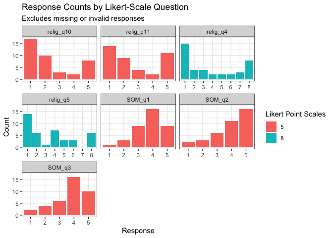

<!-- README.md is generated from README.Rmd. Please edit that file -->

# psych.data.cleanup

<!-- badges: start -->

[](https://github.com/XXinZ28/psych.data.cleanup/actions/workflows/R-CMD-check.yaml) [](https://app.codecov.io/gh/XXinZ28/psych.data.cleanup)

<!-- badges: end -->

The `psych.data.cleanup` package contains tools for processing survey data containing Likert-scale questionnaires and visualizing valid response counts. It converts all invalid values to identical format and generates a nested list of descriptive statistics for each selected question. Visual results appear as faceted bar charts in the RStudio plot window.

## Installation

You can install the development version of psych.data.cleanup from [GitHub](https://github.com/) with:

``` r
# install.packages("devtools")
devtools::install_github("XXinZ28/psych.data.cleanup")
```

## Usage

The `likert_scale_analyzer()` function processes survey data containing Likert-scale questions, and returns a nested list object with elements that summarize response counts for each question.

``` r
library(psych.data.cleanup)

likert_results <- likert_scale_analyzer(
  data = religious_som,
  likert_cols = c("relig_q4","relig_q5","relig_q10","relig_q11", "SOM_q1","SOM_q2","SOM_q3"),
  invalid_values = c(" ", "NA")
)

likert_results
#> $relig_q4
#> $relig_q4$question
#> [1] "relig_q4"
#> 
#> $relig_q4$valid_count
#> [1] 40
#> 
#> $relig_q4$invalid_count
#> [1] 57
#> 
#> $relig_q4$scale_min
#> [1] 1
#> 
#> $relig_q4$scale_max
#> [1] 8
#> 
#> $relig_q4$response_counts
#> 
#>  1  2  3  4  5  6  7  8 
#> 15  4  4  2  2  2  3  8 
#> 
#> 
#> $relig_q5
#> $relig_q5$question
#> [1] "relig_q5"
#> 
#> $relig_q5$valid_count
#> [1] 40
#> 
#> $relig_q5$invalid_count
#> [1] 57
#> 
#> $relig_q5$scale_min
#> [1] 1
#> 
#> $relig_q5$scale_max
#> [1] 8
#> 
#> $relig_q5$response_counts
#> 
#>  1  2  3  4  5  6  7  8 
#> 14  6  1  7  3  3  0  6 
#> 
#> 
#> $relig_q10
#> $relig_q10$question
#> [1] "relig_q10"
#> 
#> $relig_q10$valid_count
#> [1] 40
#> 
#> $relig_q10$invalid_count
#> [1] 57
#> 
#> $relig_q10$scale_min
#> [1] 1
#> 
#> $relig_q10$scale_max
#> [1] 5
#> 
#> $relig_q10$response_counts
#> 
#>  1  2  3  4  5 
#> 17 10  3  2  8 
#> 
#> 
#> $relig_q11
#> $relig_q11$question
#> [1] "relig_q11"
#> 
#> $relig_q11$valid_count
#> [1] 40
#> 
#> $relig_q11$invalid_count
#> [1] 57
#> 
#> $relig_q11$scale_min
#> [1] 1
#> 
#> $relig_q11$scale_max
#> [1] 5
#> 
#> $relig_q11$response_counts
#> 
#>  1  2  3  4  5 
#> 14  9  4  2 11 
#> 
#> 
#> $SOM_q1
#> $SOM_q1$question
#> [1] "SOM_q1"
#> 
#> $SOM_q1$valid_count
#> [1] 38
#> 
#> $SOM_q1$invalid_count
#> [1] 57
#> 
#> $SOM_q1$scale_min
#> [1] 1
#> 
#> $SOM_q1$scale_max
#> [1] 5
#> 
#> $SOM_q1$response_counts
#> 
#>  1  2  3  4  5 
#>  1  3  9 16  9 
#> 
#> 
#> $SOM_q2
#> $SOM_q2$question
#> [1] "SOM_q2"
#> 
#> $SOM_q2$valid_count
#> [1] 38
#> 
#> $SOM_q2$invalid_count
#> [1] 57
#> 
#> $SOM_q2$scale_min
#> [1] 1
#> 
#> $SOM_q2$scale_max
#> [1] 5
#> 
#> $SOM_q2$response_counts
#> 
#>  1  2  3  4  5 
#>  2  3  6 11 16 
#> 
#> 
#> $SOM_q3
#> $SOM_q3$question
#> [1] "SOM_q3"
#> 
#> $SOM_q3$valid_count
#> [1] 38
#> 
#> $SOM_q3$invalid_count
#> [1] 57
#> 
#> $SOM_q3$scale_min
#> [1] 1
#> 
#> $SOM_q3$scale_max
#> [1] 5
#> 
#> $SOM_q3$response_counts
#> 
#>  1  2  3  4  5 
#>  2  4  6 16 10 
#> 
#> 
#> attr(,"class")
#> [1] "Likert_List"
```

The `draw_graph()` function generates faceted bar charts given the output returned by the `likert_scale_analyzer()` function. The faceted bar charts display the valid response counts for each of the selected Likert-scale questions.

``` r
draw_graph(likert_results)
```


